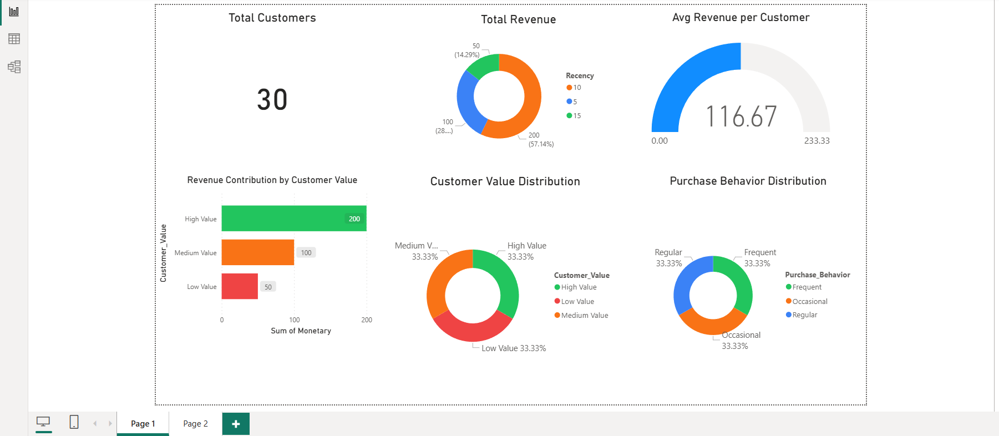
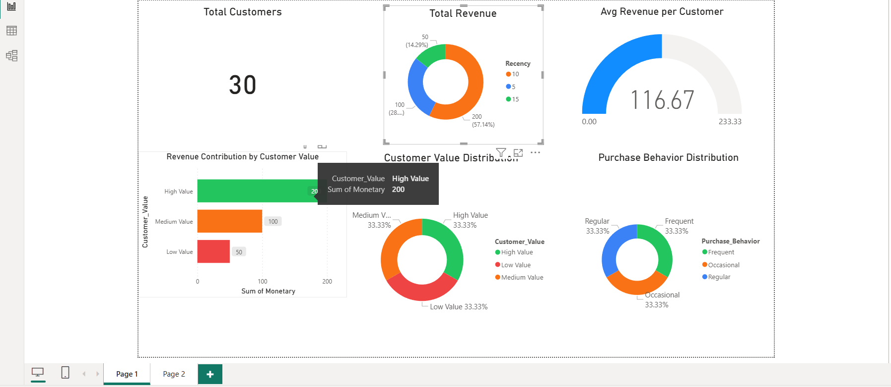
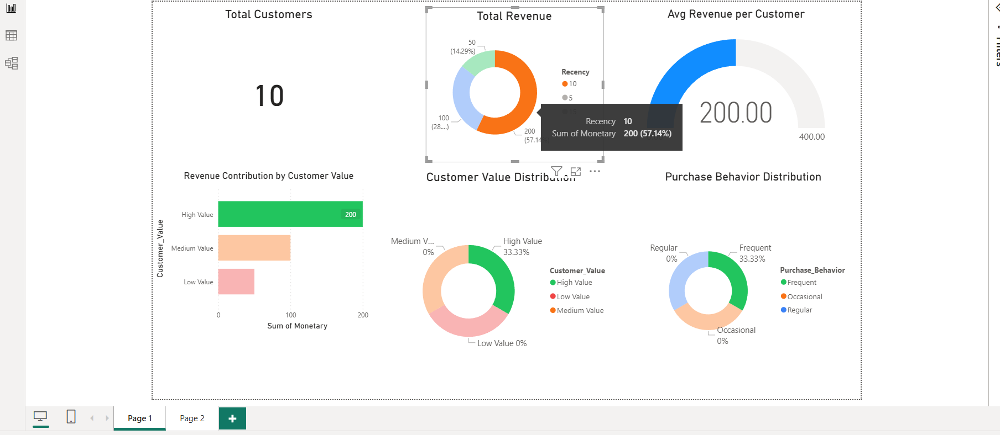

# Consumer360 – Customer Segmentation using RFM Analysis

## 📌 Project Overview
Consumer360 is a retail analytics project designed to identify high-value customers, loyal customers, and customers at risk of churn using RFM analysis.

## 🎯 Objective
- Segment customers based on purchasing behavior
- Identify high-value and at-risk customers
- Support data-driven marketing and retention strategies

## 🛠 Tools & Technologies
- Python (Pandas, NumPy)
- Power BI
- Excel
- GitHub

## 🔍 Methodology
RFM Analysis:
- Recency: Days since last purchase
- Frequency: Number of transactions
- Monetary: Total revenue per customer

Customer-level RFM metrics were calculated using Python and exported as a CSV file.

## 📊 Power BI Dashboard

### Dashboard Overview

### Customer Segmentation

### Key Performance Indicators

## 💡 Business Insights
- Identifies high-value customers contributing most revenue
- Highlights customers at risk of churn
- Helps improve targeted marketing and customer retention

## 📁 Repository Structure
- data/ → Raw & processed datasets
- notebooks/ → Python RFM analysis notebook
- powerbi/ → Power BI dashboard file
- visuals/ → Dashboard screenshots
